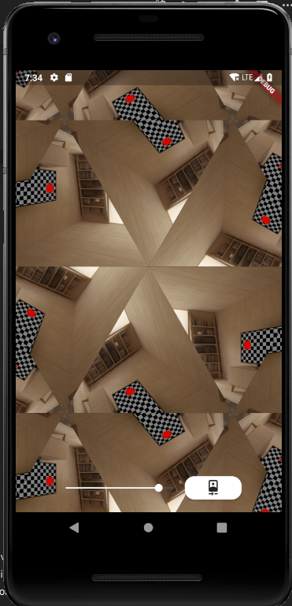
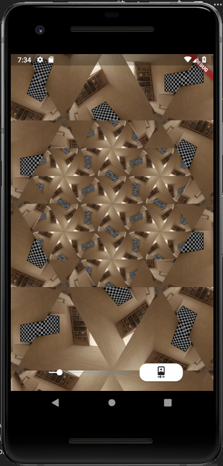
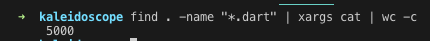

# Kaleidoscope

## Author

Filipe Barroso
twitter: abarroso

- Android! Please run this project in Android, since I only have and android device to test it properly.
- Need a working camera!

## Description

- Play around with the slider!

I got these idea from wanting taking the most of the transform widget thought it would be fun to try to replicate a kaleidoscope of sort.

Had to do some calculations on a triangle inside of a square and its rotation to build the hexagon, that is why the variables S, A, half, B, and C in the file `main.dart` .

- S : Base of the equilateral triangle and base of the square used
- A : Height of equilateral triangle inside of the square
- B : Distance of the hexagon, and used to move the hexagons
- C : The leftover distance between height of triangle and its base

It was fun!

## Screenshots

